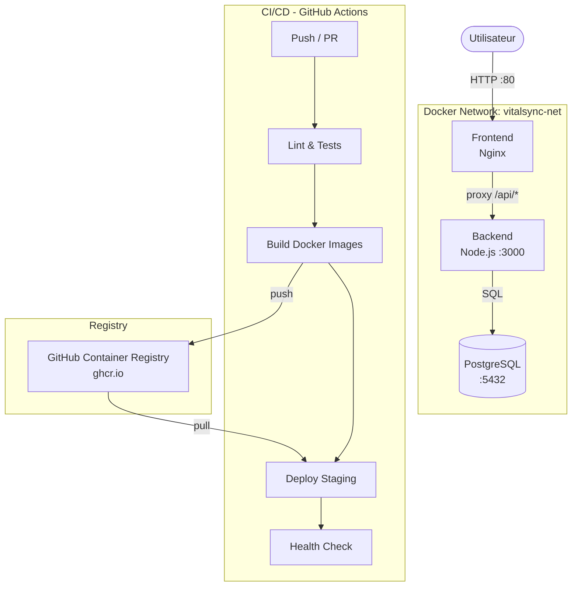

# VitalSync – Suivi médical et sportif

Application de suivi médical et sportif avec une chaîne CI/CD conteneurisée complète.

---

## Architecture



L'application est composée de trois services :

- **Frontend** : application HTML servie par Nginx sur le port `80`. Il agit également comme reverse proxy pour les requêtes `/api/*` vers le backend.
- **Backend** : API REST Node.js/Express sur le port `3000`, exposant les endpoints `/health` et `/api/activities`.
- **Database** : PostgreSQL (image officielle) avec un volume persistant pour ne pas perdre les données entre les redémarrages.

---

## Prérequis

| Outil | Version minimale | Rôle |
|---|---|---|
| Docker | 24.x | Conteneurisation |
| Docker Compose | 2.x | Orchestration locale |
| Git | 2.x | Gestion de versions |
| Node.js | 20.x | (optionnel) développement local sans Docker |

---

## Lancer l'application en local

### 1. Cloner le dépôt

```bash
git clone https://github.com/<votre-username>/vitalsync.git
cd vitalsync
```

### 2. Configurer les variables d'environnement

```bash
cp .env.example .env
# Éditer .env avec vos valeurs
```

### 3. Lancer tous les services

```bash
docker-compose up --build
```

Les services seront accessibles sur :

- **Frontend** → [http://localhost:80](http://localhost:80)
- **Backend API** → [http://localhost:3000](http://localhost:3000)
- **Health check** → [http://localhost:3000/health](http://localhost:3000/health)

### 4. Arrêter les services

```bash
docker-compose down
# Pour supprimer aussi les volumes (supprime les données PostgreSQL) :
docker-compose down -v
```

---

## 🔧 Structure du projet

```
vitalsync/
├── .github/
│   └── workflows/
│       └── ci-cd.yml          # Pipeline GitHub Actions
├── backend/
│   ├── Dockerfile             # Multi-stage build Node.js
│   ├── .dockerignore
│   ├── eslint.config.js       # Configuration ESLint
│   ├── server.js              # API Express
│   ├── package.json
│   └── test/
│       └── health.test.js     # Tests Jest
├── frontend/
│   ├── Dockerfile             # Image Nginx
│   ├── index.html
│   └── nginx.conf             # Config Nginx + proxy_pass
├── k8s/
│   ├── deployment-backend.yaml
│   ├── service-backend.yaml
│   ├── ingress-frontend.yaml
│   └── secret.yaml
├── .env.example               # Template des variables d'environnement
├── .gitignore
└── docker-compose.yml         # Orchestration locale
```

---

## Pipeline CI/CD

La pipeline est configurée avec **GitHub Actions** (`.github/workflows/ci-cd.yml`).

### Déclencheurs

| Événement | Branche | Action déclenchée |
|---|---|---|
| `push` | `develop` | Pipeline complète |
| `pull_request` vers | `main` | Pipeline complète |

### Étapes

```
┌─────────────────────────────────────────────────────┐
│  1. Lint & Tests                                     │
│     └─ npm install → ESLint → Jest                  │
│                                                      │
│  2. Build Docker                                     │
│     └─ docker build (backend + frontend)             │
│     └─ tag image avec le SHA du commit               │
│     └─ push vers GHCR                               │
│                                                      │
│  3. Deploy Staging                                   │
│     └─ docker-compose up                            │
│     └─ health check sur /health                     │
│     └─ échec de la pipeline si health check KO      │
└─────────────────────────────────────────────────────┘
```

**Pourquoi tagger les images avec le SHA du commit ?**
Contrairement au tag `latest` qui est écrasé à chaque build, le SHA du commit identifie de façon unique et immuable l'image correspondant à un état précis du code, ce qui facilite le rollback et la traçabilité.

---

## Gestion des secrets

Les secrets (credentials Docker Hub, token GitHub, mots de passe PostgreSQL) sont stockés dans les **GitHub Actions Secrets** et jamais en clair dans le code.

Un fichier `.env.example` est versionné à la racine pour documenter les variables nécessaires sans exposer les valeurs réelles.

---

## 🐳 Choix techniques

| Élément | Choix | Justification |
|---|---|---|
| CI/CD | GitHub Actions | Intégration native avec GHCR et le dépôt GitHub, zéro configuration externe |
| Registry | GHCR (ghcr.io) | Gratuit, intégré à GitHub, aucune clé externe supplémentaire requise |
| Image backend | `node:20-alpine` | ~5x plus légère que Debian, surface d'attaque réduite |
| Image frontend | `nginx:alpine` | Image officielle légère, stable pour du contenu statique |
| Multi-stage build | Oui | Sépare l'environnement de test de l'image de production finale |
| Réseau Docker | Bridge dédié | Isolation des conteneurs, communication par nom de service |
| Volume PostgreSQL | Nommé | Persistance des données entre les redémarrages des conteneurs |
| Convention commits | Conventional Commits | Génération de changelogs automatisable, lisibilité de l'historique |

---

## Lancer les tests manuellement

```bash
cd backend
npm install
npm test
```

---

## Kubernetes (manifestes)

Les manifestes Kubernetes sont disponibles dans le dossier `k8s/` :

- `deployment-backend.yaml` – Deployment avec 2 réplicas et liveness probe
- `service-backend.yaml` – Service ClusterIP pour le backend
- `ingress-frontend.yaml` – Ingress pour exposer le frontend
- `secret.yaml` – Secret pour le mot de passe PostgreSQL

---
